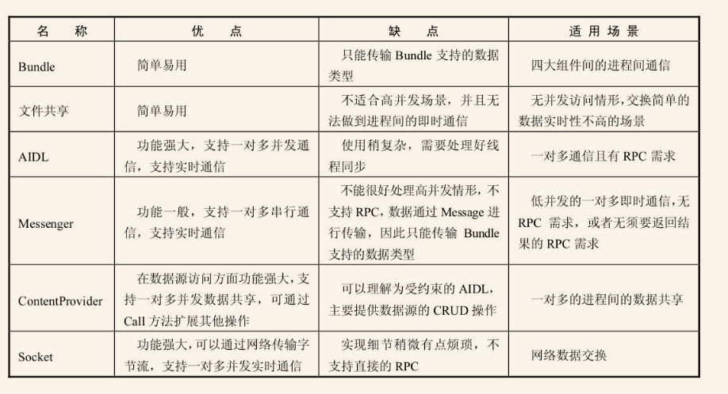
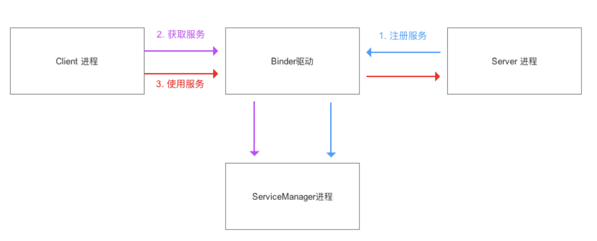
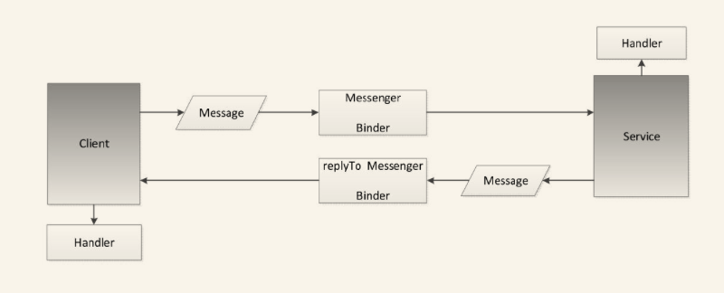

# Android IPC
---




## Binder
---

1、从机制角度说：Binder机制是Android中实现跨进程通信的方式，用于用户空间及内核空间通信，基于mmap映射

  从模型来说：Binder是一种虚拟的物理设备驱动，连接service进程，Client进程，Service Manager进程
  
  Binder驱动持有每个Server进程对应的Binder实体，并给Client进程提供Binder引用
  
  Service进程会创建很多线程处理Binder请求，会采用由Binder驱动管理的线程池



  从代码实现说：Binder是一个实现IBinder接口的类


2、实现流程：

1）Server进程通过Binder驱动向ServiceManager进程注册服务：Server进程创建Binder实体对象


```
  Binder binder =new Stub()

  IInterface plus=new Iplus()

  binder.attachInterface(plus,"plus")

  public class Stub extends Binder{

      @Override
      boolean onTransact(int code, Parcel data, Parcel reply, int flags){
          ...
      }         
  }

  public class Binder implement IBinder{
        //将（descriptor，plus）作为（key,value）对存入到Binder对象中的一个Map<String,IInterface>对象中
        void attachInterface(IInterface plus, String descriptor)；
      
        // 根据 参数 descriptor 查找相应的IInterface对象（即plus引用）
        IInterface queryLocalInterface(Stringdescriptor) ；

        // 执行Client进程所请求的目标方法（子类需要复写）
        boolean onTransact(int code, Parcel data, Parcel reply, int flags)；

        // 即Server进程创建的Binder对象的代理对象类
        final class BinderProxy implements IBinder {
            ...
        }
  }
  
  public interface IInterface{
      //返回当前接口关联的 Binder 对象。
      public IBinder asBinder();
  }

```

2）Client进程通过Binder驱动向ServiceManager进程获取Binder代理对象

Clent通过bindService()绑定Server进行，onServiceConnected()中获取Binder代理对象

3）Client进程通过BinderProxy.transact()将序列化数据传递给Server端，线程挂起

4）Server端Binder.onTransact()处理数据，将结果写入reply

3、生命周期

linkToDeath和unlinkToDeath

RemoteCallbackList删除跨进程listener


## 序列化
---

1、Serializable方式

serialVersionUID

ObjectOutputStream ObjectInputStream

2、Parcelable方式

writeToParcel

describeContents

Creator：（createFromParcel，newArray，private构造方法）


## AIDL
---

1、AIDL接口

继承自IInterface

内部类Stub(binder):asInterface，asBinder，onTracsact

内部代理类(Proxy)：输入输出Parcel对象，调用transact方法发起RPC请求

权限检查：onBind permission验证，onTracsact验证

```
public interface IUserManager extends IInterface {

    // 内部Binder类
    public static abstract class Stub extends Binder implements IUserManager{

        private static final java.lang.String DESCRIPTOR = "com.susion.demo.aidl.IUserManager";
        static final int TRANSACTION_userCount = (android.os.IBinder.FIRST_CALL_TRANSACTION + 0);

        public Stub() {
            this.attachInterface(this, DESCRIPTOR);
        }

        // 返回自定义AIDL接口
        public static IUserManager asInterface(IBinder obj) {
            android.os.IInterface iin = obj.queryLocalInterface(DESCRIPTOR);
            if (((iin != null) && (iin instanceof com.susion.demo.aidl.IUserManager))) {
                return ((com.susion.demo.aidl.IUserManager) iin);
            }
            return new com.susion.demo.aidl.IUserManager.Stub.Proxy(obj);
        }

        @Override
        public android.os.IBinder asBinder() {retun this;}

        @Override
        public boolean onTransact(int code, Parcel data, Parcel reply, int flags)  {...}

        private static class Proxy implements IUserManager {
            private android.os.IBinder mRemote;

            Proxy(android.os.IBinder remote) {
                mRemote = remote;
            }

            @Override
            public android.os.IBinder asBinder() {
                return mRemote;
            }

            public java.lang.String getInterfaceDescriptor() {
                return DESCRIPTOR;
            }
            ...
        }

    }
}
```


## Messenger：串行请求
---




Service端：通过Handler创建Messenger信使，onBinder返回Messenger 的Binder

Client端：获取Messenger代理对象，send方法发送消息Message，通过msg.replyTo返回客户端Messenger


## Bundle/ContentProvider/文件共享/Socket
---


