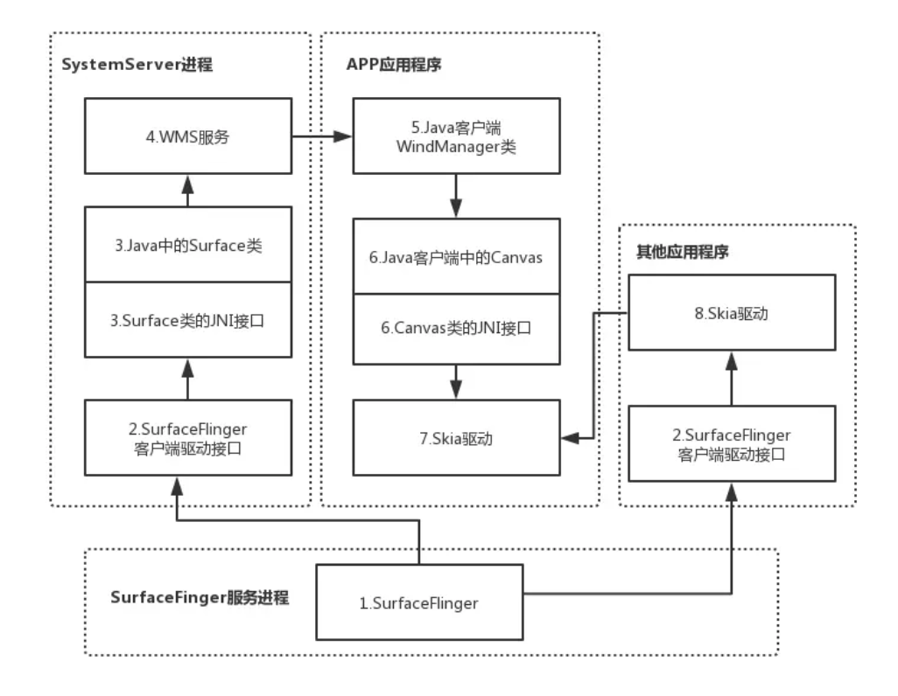

# Android View机制

## View绘制：
---

1、requestRootImpl.requestLayout

线程检查

scheduleTraversals()：mTraversalScheduled（去除重复绘制）, 
   Choreographer提交绘制任务doTraversal()，Handler post异步消息屏障

Handler回调performTraversals：performMeasure,performLayout,performDrow

#### 2、Measure：

**1）MeasureSpec获取：**

SpecMode+SpecSizeSpecMode+SpecSize（EXACTLY，AT_MOST，UNSPECIFIED）

UNSPECIFIED：用于NestedScrollView和ScrollView

ViewRootImpl.performTraversals()
ViewGroup.measureChildWithMargins()

```
childwidthMeasureSpec = getRootMeasureSpec(desiredWindowWidth, lp.width);
childHeightMeasureSpec = getRootMeasureSpec(desiredWindowHeight, lp.width);
performMeasure(childwidthMeasureSpec,childheightMeasureSpec);

```


**2）调用流程：**

View.measure() -> View.onMeasure()(setMeasuredDimension/getDefaultSize) -> ViewGroup.measureChidren

ViewGroup类提供了measureChildren, measureChild, measureChildWithMargins方法，简化了父子View的尺寸计算。
measureChildren内部实质只是循环调用measureChild，measureChild和measureChildWithMargins的区别是margin和padding也作为子视图的大小

```
    // onMeasure默认实现，通过getDefaultSize对成员变量mMeasuredWidth和mMeasuredHeight进行赋值
    protected void onMeasure(int widthMeasureSpec, int heightMeasureSpec) {
        setMeasuredDimension(getDefaultSize(getSuggestedMinimumWidth(), widthMeasureSpec),
                getDefaultSize(getSuggestedMinimumHeight(), heightMeasureSpec));
    }
    
    public static int getDefaultSize(int size, int measureSpec) {
        int result = size;
        int specMode = MeasureSpec.getMode(measureSpec);
        int specSize = MeasureSpec.getSize(measureSpec);

        switch (specMode) {
        case MeasureSpec.UNSPECIFIED:
            result = size;
            break;
        case MeasureSpec.AT_MOST:
        case MeasureSpec.EXACTLY:
            result = specSize;
            break;
        }
        return result;
    }
    
```


#### 3、Layout过程：

layout（setFrame确定四个顶点位置） onlayout(具体view重写，setChildFrame调用子layout方法)

#### 4、Draw过程：

background.draw

ondraw 绘制自我

dispatchDraw绘制children

onDrawScrollBars




## View事件分发

#### 1、ViewGroup.dispatchTouchEvent()流程

是否判断拦截：ACTION_DOWN， mFirstTouchTarget != null， FLAG_DISALLOW_INTERCEPT(不拦截标记位，子View requestDisallowInterceptTouchEvent)

拦截事件onInterceptTouchEvent：默认false，子类可重写

dispatchTransformedTouchEvent：调用view或子view.dispatchTouchEvent

```
    public boolean dispatchTouchEvent(MotionEvent ev) {
        ...
        
        boolean handled = false;
        if (onFilterTouchEventForSecurity(ev)) {
            final int action = ev.getAction();
            final int actionMasked = action & MotionEvent.ACTION_MASK;
            // down事件则重新开始事件流
            if (actionMasked == MotionEvent.ACTION_DOWN) {
                cancelAndClearTouchTargets(ev);
                resetTouchState();
            }

            // 判断是否拦截
            final boolean intercepted;
            if (actionMasked == MotionEvent.ACTION_DOWN
                    || mFirstTouchTarget != null) {
                final boolean disallowIntercept = (mGroupFlags & FLAG_DISALLOW_INTERCEPT) != 0;
                if (!disallowIntercept) {
                    intercepted = onInterceptTouchEvent(ev);
                    ev.setAction(action);
                } else {
                    intercepted = false;
                }
            } else {
                intercepted = true;
            }
            ...

            final boolean split = (mGroupFlags & FLAG_SPLIT_MOTION_EVENTS) != 0;
            TouchTarget newTouchTarget = null;
            boolean alreadyDispatchedToNewTouchTarget = false;
            if (!canceled && !intercepted) {
                ...
                  // 循环遍历子View
                  for (int i = childrenCount - 1; i >= 0; i--) 
                    ...
                    // 调用子View.dispatchTouchEvent,设置mFirstTouchTarget
                    dispatchTransformedTouchEvent(ev, false, child, idBitsToAssign)) 
                     ...
            }

            
            if (mFirstTouchTarget == null) {
                // 调用当前view.dispatchTouchEvent
                handled = dispatchTransformedTouchEvent(ev, canceled, null,
                        TouchTarget.ALL_POINTER_IDS);
            } else{
                // 除Down事件外的事件交由指定子View处理
                ...
            }
              ...
        return handled;
    }

  // 是否拦截事件，子类重写，默认数false 
  public boolean onInterceptTouchEvent(MotionEvent ev)
  
```

#### 2、View.dispatchTouchEvent

onTouchEvent()：Clickable或LongClickable为true则返回true，ACTION_UP事件会触发OnClickListener

```
public boolean dispatchTouchEvent(MotionEvent event) {
    ...
    // 判断OnTouchListener
    if (onFilterTouchEventForSecurity(event)) {
        ListenerInfo li = mListenerInfo;
        if (li != null && li.mOnTouchListener != null
                && (mViewFlags & ENABLED_MASK) == ENABLED
                && li.mOnTouchListener.onTouch(this, event)) {
            result = true;
        }

        if (!result && onTouchEvent(event)) {
            result = true;
        }
    }
    ...
    return result;
}


public boolean onTouchEvent(MotionEvent event) {
    ...
    if ((viewFlags & ENABLED_MASK) == DISABLED) {
        if (action == MotionEvent.ACTION_UP && (mPrivateFlags & PFLAG_PRESSED) != 0) {
            setPressed(false);
        }
        // 是否可点击
        return (((viewFlags & CLICKABLE) == CLICKABLE
                || (viewFlags & LONG_CLICKABLE) == LONG_CLICKABLE)
                || (viewFlags & CONTEXT_CLICKABLE) == CONTEXT_CLICKABLE);
    }
    ...
    
    if (((viewFlags & CLICKABLE) == CLICKABLE ||
            (viewFlags & LONG_CLICKABLE) == LONG_CLICKABLE) ||
            (viewFlags & CONTEXT_CLICKABLE) == CONTEXT_CLICKABLE) {
        switch (action) {
            case MotionEvent.ACTION_UP:
                // 判断是否调用onClickListenser()
                performClick();
            
            // 检查是否在scrollView内，设置点击态    
            case MotionEvent.ACTION_DOWN:
                setPressed(true, x, y);
                ... 
            // 重置状态    
            case MotionEvent.ACTION_CANCEL:
                ...
            // 判断点击区域是否在view内
            case MotionEvent.ACTION_MOVE:
                ...
        }
        return true;
    }
    return false;
}

```

3、滑动冲突：

外部拦截法：重写父类onInterceptTouchEvent方法

内部拦截法：重写父类onInterceptTouchEvent方法， 重写子类dispatchTouchEvent方法， 调用requestDisallowInterceptTouchEvent


## 自定义View

1、继承View：

重写onDraw(padding)

重写onMeasure(wrap_content)

```
    // wrap_parent 适配
    protected void onMeasure(int widthMeasureSpec, int heightMeasureSpec) {
    	//第一步:调用super.onMeasure()
    	super.onMeasure(widthMeasureSpec , heightMeasureSpec);
	    int widthSpecMode = MeasureSpec.getMode(widthMeasureSpec);
	    int widthSpceSize = MeasureSpec.getSize(widthMeasureSpec);
	    int heightSpecMode=MeasureSpec.getMode(heightMeasureSpec);
	    int heightSpceSize=MeasureSpec.getSize(heightMeasureSpec);
	    
	    //第二步:处理子View的大小为wrap_content的情况
	    if(widthSpecMode==MeasureSpec.AT_MOST&&heightSpecMode==MeasureSpec.AT_MOST){
	    	setMeasuredDimension(mWidth, mHeight);
	    }else if(widthSpecMode==MeasureSpec.AT_MOST){
	    	setMeasuredDimension(mWidth, heightSpceSize);
	    }else if(heightSpecMode==MeasureSpec.AT_MOST){
	    	setMeasuredDimension(widthSpceSize, mHeight);
	    } 
	 }
```


2、继承特定View

3、继承ViewGroup

需支持wrap_content， padding， margin

4、继承特定ViewGroup

#### 5、注意点：

自定义属性

wrap_content， padding， margin处理

多线程使用post

避免内存泄露（线程/动画停止）

滑动冲突


## 屏幕适配

1、dp适配

2、宽高限定符

3、头条适配方案


