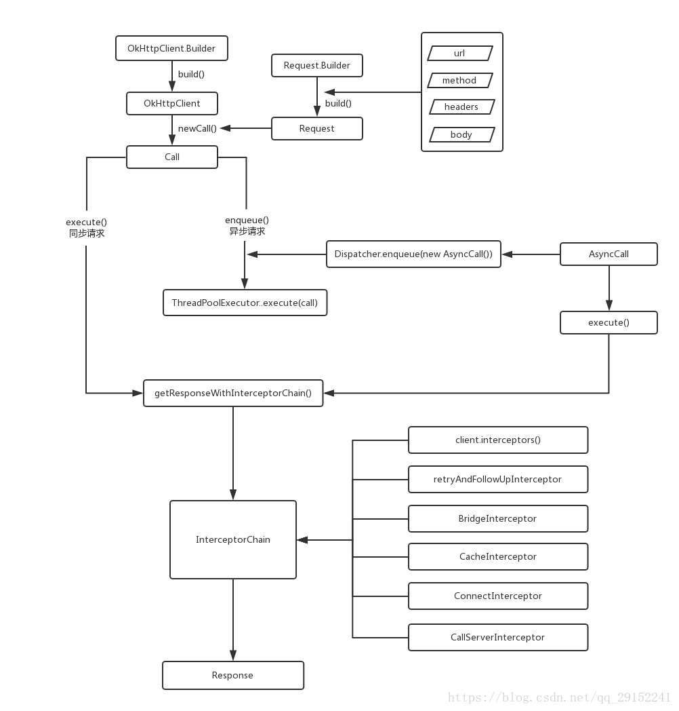

# Android 框架

## OkHttp
---



#### 1、request：url/method/headers/body  封装Params

#### 2、realCall：OkHttpClient + request 

同步请求 execute()， 异步请求enqueue()   调用Diaspatcher对应方法

#### 3、Dispatcher调度器：

等待执行的异步队列readyAsyncCalls， 正在执行的异步队列runningAsyncCalls

ThreadPoolExecutor(0, Integer.MAX_VALUE, 60, TimeUnit.SECONDS,new SynchronousQueue<Runnable>())

#### 4、getResponseWithInterceptorChain：

①.用户自定义的拦截器

②.retryAndFollowUpInterceptor：重试和重定向拦截器，主要负责网络失败重连。

③.BridgeInterceptor：主要负责添加交易请求头。

④.CacheInterceptor：缓存拦截器，主要负责拦截缓存。

⑤.ConnectInterceptor：网络连接拦截器，主要负责正式开启http请求。

⑥.CallServerInterceptor：负责发送网络请求和读取网络响应。


#### 5、RealInterceptorChain(interceptors)

责任链模式：Chain保存interceptors列表和执行顺序，

chain.proceed() 调用下一个interceptor

interceptor.intercept() 调用chain.proceed()

#### 6、Reponse: 责任链模式

```
  class Handler {
        protected Handler mNextHandler;
        
        public abstract void handleRequest(String request);
    }
```


## EventBus
---

#### EventBus.getDefault().register(this)：


```
  // 保存eventType和对应Subscription集合
  Map\<Class\<?\>, CopyOnWriteArrayList\<Subscription\>\> subscriptionsByEventType

  public void register(Object subscriber) {
        Class<?> subscriberClass = subscriber.getClass();
        
        // 查找类中subscriber 方法
        List<SubscriberMethod> subscriberMethods = subscriberMethodFinder.findSubscriberMethods(subscriberClass);
        synchronized (this) {
            for (SubscriberMethod subscriberMethod : subscriberMethods) {
                subscribe(subscriber, subscriberMethod);
            }
        }
    }
    
    private void subscribe(Object subscriber, SubscriberMethod subscriberMethod) {
        // 从订阅方法中拿到订阅事件的类型  
        Class<?> eventType = subscriberMethod.eventType;
        // 创建一个新的订阅
        Subscription newSubscription = new Subscription(subscriber, subscriberMethod);
        // 通过订阅事件类型，找到所有的订阅（Subscription）,订阅中包含了订阅者，订阅方法
        CopyOnWriteArrayList<Subscription> subscriptions = subscriptionsByEventType.get(eventType);
        if (subscriptions == null) {
            // 如果该订阅事件类型 没有订阅列表，那么创建一个该事件类型的订阅列表
            subscriptions = new CopyOnWriteArrayList<>();
            subscriptionsByEventType.put(eventType, subscriptions);
        } else {
            if (subscriptions.contains(newSubscription)) {
                throw new EventBusException();
            }
        }
        
        int size = subscriptions.size();
        // 根据订阅方法的优先级，添加到订阅列表
        for (int i = 0; i <= size; i++) {
            if (i == size || subscriberMethod.priority > subscriptions.get(i).subscriberMethod.priority) {
                subscriptions.add(i, newSubscription);
                break;
            }
        }
        
        // 将这个订阅事件加入到订阅者的订阅事件列表中
        List<Class<?>> subscribedEvents = typesBySubscriber.get(subscriber);
        if (subscribedEvents == null) {
            subscribedEvents = new ArrayList<>();
            typesBySubscriber.put(subscriber, subscribedEvents);
        }
        subscribedEvents.add(eventType);

        // 粘性事件处理
        if (subscriberMethod.sticky) {
            ...
        }
    }
```

#### EventBus.getDefault().post(Event)：

```

public void post(Object event) {
    // ThreadLocal类型
    PostingThreadState postingState = currentPostingThreadState.get();
    List <Object> eventQueue = postingState.eventQueue;
    eventQueue.add(event);
    ...
    postSingleEvent(eventQueue.remove(0), postingState);     
}

// 取出Event类型
postSingleEvent()

// 根据Event类型取出对应subscriptions
postSingleEventForEventType()

// 根据threadMode判断在哪个线程执行
postToSubscription()

```

#### 粘性事件：保存在内存中，可以先发送后注册


## ImageLoader
---

1、图片压缩BitmapFactory.Options

2、LruCache -- LinkedHashMap

3、DiskLruCache

4、异步加载


## Glide
---

1、with(context)：返回RequestManager

context处理：Application--getApplicationManager    Activity --FragmentGet

2、load(url)：返回DrawableTypeRequest

DrawableTypeRequestBuilder创建者模式

3、into(imageView)：

Glide.buildImageViewTarget

into(target)：buildRequest，setRequest，track请求


## CameraView
---


## Oboe
---

#### JNI开发：

CmakeList配置， Gradle配置， native-lib.cpp

#### 播放流程

1、load() 加载音源

```
void SoundPlayer::load() {
    // 创建音频流AudioStream
    AudioStreamBuilder builder;
    builder.setCallback(this);
    builder.setPerformanceMode(PerformanceMode::LowLatency);
    builder.setSharingMode(SharingMode::Exclusive);
    Result result = builder.openStream(&mAudioStream);

    for (string file:files) {
        // 创建音频源并加入Mixer中
        std::shared_ptr<AAssetDataSource> mClapSource{
                AAssetDataSource::newFromCompressedAsset(mAssetManager, (FILEPREFIX + file).data(), targetProperties)
        };
        
        std::shared_ptr<Player> mClap = std::make_shared<Player>(mClapSource);
        mMixer.addTrack(mClap.get());
    }
    Result result1 = mAudioStream->requestStart();
}

```

2、onAdudioReady() Stream回调

```
DataCallbackResult SoundPlayer::onAudioReady(AudioStream *oboeStream, void *audioData, int32_t numFrames) {

    mMixer.renderAudio(static_cast<float *>(audioData), numFrames);
    return DataCallbackResult::Continue;
}
```

3、play() 

```
void SoundPlayer::play(const char *fileName) {
    std::shared_ptr<Player> mClap = sounds[fileName];
    mClap->setPlaying(true);
}
```


## MVP、MVC、clean架构
---

## Android Jetpack
---

Lifecyle、LiveData、ViewModel、Room、DadaBinding、Navigation、Paging、WorkManager

Lifecycle：实现和activity、fragment生命周期感知的框架，实现数据层和view层销毁的时候解绑。原理是Lifecycler为每个活动组件添加了一个没有界面的Fragment，利用Fragment周期会根据活动声明周期变化的特性实现的特性，从而实现生命周期的感知，然后根据注解的Event查找执行相应的方法。‘

LiveData：提供了一种数据改变的同时，主动去告诉ui，让ui层做出相应的逻辑判断。原理是内部保存了LifecycleOwner和Observer，利用LifecycleOwner感知并处理声明中期的变化，Observer在数据改变时遍历所有观察者并回调方法。

ViewModel：它是我们view层和model层的桥梁，是数据驱动界面的关键地方，也是我们ui层在数据丢失的情况下，viewModel还能继续保持原有的数据，原理是将数据保存到ViewModel中，然后为活动中添加一个HolderFragment，HolderFragment中保存了ViewStore的实例，ViewStore中使用Map保存了ViewModel，从而在活动重新创建时获取到原来的ViewModel。

Room：是model层本地数据库的框架，通过实体映射到对应的db表结构，将实体映射到db关系型数据库里面。

DadaBinding：是一个可以通过在xml布局文件中实现ui逻辑的框架

Navigation：可视化管理fragment的组件，通过在xml中配置fragment之间跳转的关系。


## Hook
---

```
public class HookUtil {

    private Class<?> proxyActivity;

    private Context context;

    public HookUtil(Class<?> proxyActivity, Context context) {
        this.proxyActivity = proxyActivity;
        this.context = context;
    }

    public void hookAms() {
        
        //一路反射，直到拿到IActivityManager的对象
        try {
            Class<?> ActivityManagerNativeClss = Class.forName("android.app.ActivityManagerNative");
            Field defaultFiled = ActivityManagerNativeClss.getDeclaredField("gDefault");
            defaultFiled.setAccessible(true);
            Object defaultValue = defaultFiled.get(null);
            //反射SingleTon
            Class<?> SingletonClass = Class.forName("android.util.Singleton");
            Field mInstance = SingletonClass.getDeclaredField("mInstance");
            mInstance.setAccessible(true);
            //到这里已经拿到ActivityManager对象
            Object iActivityManagerObject = mInstance.get(defaultValue);
            
            
            //开始动态代理，用代理对象替换掉真实的ActivityManager，瞒天过海
            Class<?> IActivityManagerIntercept = Class.forName("android.app.IActivityManager");

            AmsInvocationHandler handler = new AmsInvocationHandler(iActivityManagerObject);

            Object proxy = Proxy.newProxyInstance(Thread.currentThread().getContextClassLoader(), new Class<?>[]{IActivityManagerIntercept}, handler);

            //现在替换掉这个对象
            mInstance.set(defaultValue, proxy);


        } catch (Exception e) {
            e.printStackTrace();
        }
    }


    private class AmsInvocationHandler implements InvocationHandler {

        private Object iActivityManagerObject;

        private AmsInvocationHandler(Object iActivityManagerObject) {
            this.iActivityManagerObject = iActivityManagerObject;
        }

        @Override
        public Object invoke(Object proxy, Method method, Object[] args) throws Throwable {

            Log.i("HookUtil", method.getName());
            //我要在这里搞点事情
            if ("startActivity".contains(method.getName())) {
                Log.e("HookUtil","Activity已经开始启动");
                Log.e("HookUtil","小弟到此一游！！！");
            }
            return method.invoke(iActivityManagerObject, args);
        }
    }
}
```

## 热修复组件化
---

1、代码修复：

底层替换方案：ArtMethod，对类的方法进行替换，无法对方法或字段进行增减

类加载方案：dex数组替换，需要冷启动

2、资源修复：

instantRun：新建AssertManager，反射调用addAssertPath加载新资源，替换原有AssertManger

设置新资源package_id 0x66，反射调用addAssertPath加载新资源包ID

3、so修复：

将补丁so库插入nativeLibraryDirectories数组的最前面，


## 性能优化
---

1、启动优化

2、电量优化

3、包大小优化

4、内存优化

5、UI优化

6、网络优化


