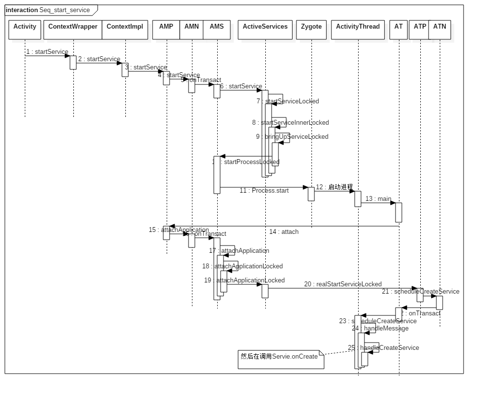
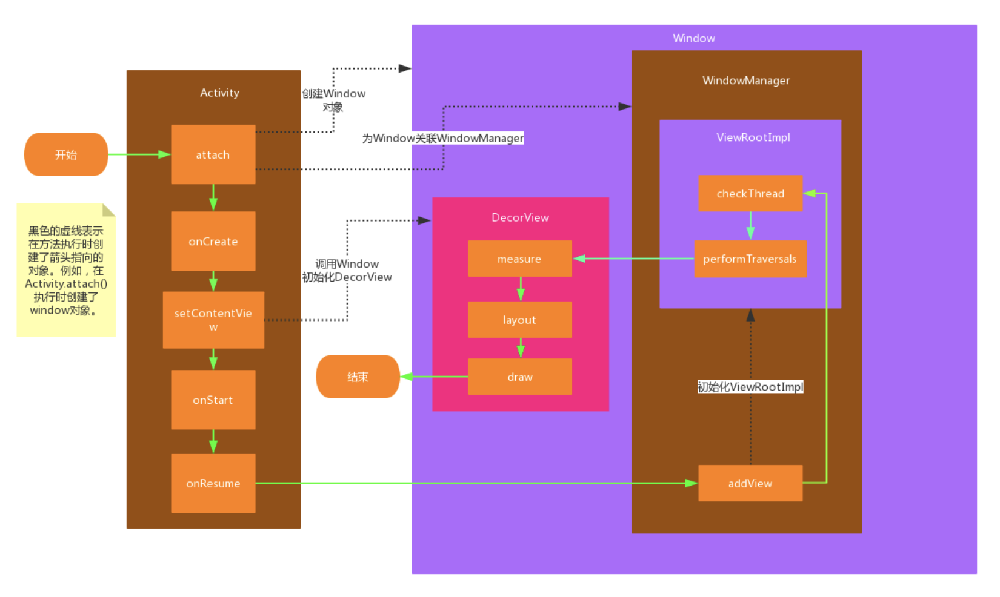

# Android启动流程

## 系统启动
---

**1、init进程：**

创建和挂载启动所需文件和目录

初始化和启动属性服务

解析init.rc，启动zygote进程

**2、zygote进程：**

runtime.start()启动zygote进程，创建虚拟机并注册JNI

zygoteInit.main()：创建server端socket，runSelectLoop等待AMS创建APP进程，启动SystemServer进程

**3、SystemServer进程：**

启动Binder线程池

创建SystemServiceManager

启动各种服务（ActivityManagerService...）


## Activity启动
---

1、Launcher通过Binder通知AMS（Instrumentation）


AMS处理startActivity请求（SystemServer进程，ActivityStack）
(ActivityManagerNative.getDefault()就可以得到远程的activity的服务AMS对应的Binder引用，并且调用asInterface将其转化为IActivityManage)

launcher处理Pause请求

AMS处理activityPause请求


2、ActivityStack.startSpecificAcitivityLocked判断是否启动新进程

AMS.startProcessLocked()： 需要则Process.start()通过zygote进程启动app进程，不需要则通过H回调ActivityThread. handleLaunchActivity()

ActivThread.main()： 创建ActivityThread并绑定AMS，开启Looper，创建Binder本地对象ApplicationThread()，绑定完成后调用ApplicationThreadProxy. scheduleLaunchActivity()


**3、ActivityThread. performLaunchActivity：**

1）获取待启动的Activity的组件信息

2）创建ContextImpl

3）使用类加载器创建Activity Instrumentation.newActivity()

4）makeApplication创建Application

5）Activity.attach()创建window（mWindow = new PhoneWindow()）

6）Instrumentation. callActivityOnCreate()

7）activity.performStart()

```
private Activity performLaunchActivity(ActivityClientRecord r, Intent customIntent) {
    ...
    ActivityInfo aInfo = r.activityInfo;
    if (r.packageInfo == null) {
        //step 1: 创建LoadedApk对象
        r.packageInfo = getPackageInfo(aInfo.applicationInfo, r.compatInfo,
                Context.CONTEXT_INCLUDE_CODE);
    }
    ... //component初始化过程

    java.lang.ClassLoader cl = r.packageInfo.getClassLoader();
    //step 2: 创建Activity对象
    Activity activity = mInstrumentation.newActivity(cl, component.getClassName(), r.intent);
    ...

    //step 3: 创建Application对象
    Application app = r.packageInfo.makeApplication(false, mInstrumentation);

    if (activity != null) {
        //step 4: 创建ContextImpl对象
        Context appContext = createBaseContextForActivity(r, activity);
        CharSequence title = r.activityInfo.loadLabel(appContext.getPackageManager());
        Configuration config = new Configuration(mCompatConfiguration);
        //step5: 将Application/ContextImpl都attach到Activity对象
        activity.attach(appContext, this, getInstrumentation(), r.token,
                r.ident, app, r.intent, r.activityInfo, title, r.parent,
                r.embeddedID, r.lastNonConfigurationInstances, config,
                r.referrer, r.voiceInteractor);

        ...
        int theme = r.activityInfo.getThemeResource();
        if (theme != 0) {
            activity.setTheme(theme);
        }

        activity.mCalled = false;
        if (r.isPersistable()) {
            //step 6: 执行回调onCreate
            mInstrumentation.callActivityOnCreate(activity, r.state, r.persistentState);
        } else {
            mInstrumentation.callActivityOnCreate(activity, r.state);
        }

        r.activity = activity;
        r.stopped = true;
         //执行回调onStart
        if (!r.activity.mFinished) {
            activity.performStart();
            r.stopped = false;
        }
        if (!r.activity.mFinished) {
            //执行回调onRestoreInstanceState
            if (r.isPersistable()) {
                if (r.state != null || r.persistentState != null) {
                    mInstrumentation.callActivityOnRestoreInstanceState(activity, r.state,
                            r.persistentState);
                }
            } else if (r.state != null) {
                mInstrumentation.callActivityOnRestoreInstanceState(activity, r.state);
            }
        }
        ...
        r.paused = true;
        mActivities.put(r.token, r);
    }

    return activity;
}

```


4、setContentView()：

phoneWindow.setContentWindow

phoneWindow.installDecor()创建dectorview（mDecor = generateDecor()，mContentParent = generateLayout(mDecor)）


5、ActivityThread.handleResumeActivity()：

```
    void makeVisible() {
        if (!mWindowAdded) {
            ViewManager wm = getWindowManager();
            //1. ViewManager添加View
            wm.addView(mDecor, getWindow().getAttributes());
            mWindowAdded = true;
        }
        //DecorView设置可见性
        mDecor.setVisibility(View.VISIBLE);
    }
    
    // addView() 创建ViewrootImpl，并将DecorView交给ViewRootImpl  
    root.setView(view, wparams, panelParentView);
    
    
```





6、phoneview —— dectorview  —— viewrootImpl





## 打包流程

aapt资源->编译class->dex->apk->签名


