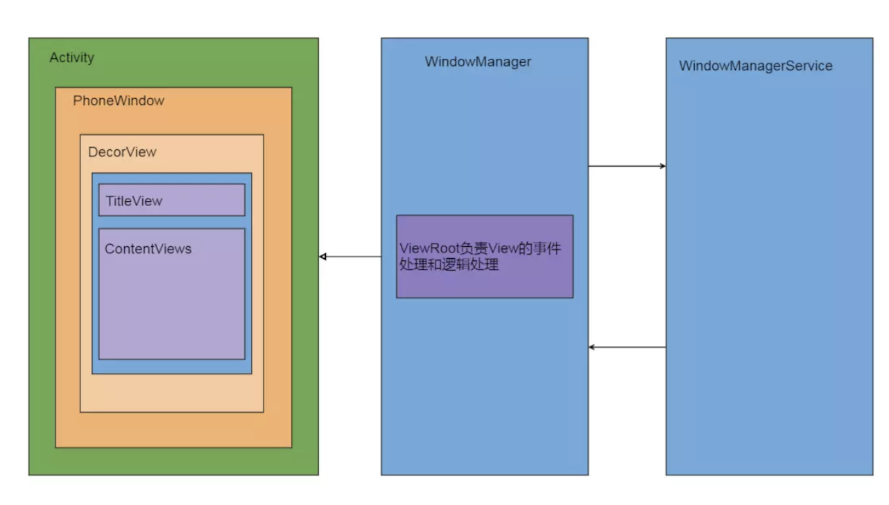

# Android启动流程

## 系统启动
---

**1、init进程：**

创建和挂载启动所需文件和目录

初始化和启动属性服务

解析init.rc，启动zygote进程

**2、zygote进程：**

runtime.start()启动zygote进程，创建虚拟机并注册JNI

zygoteInit.main()：创建server端socket，runSelectLoop等待AMS创建APP进程，启动SystemServer进程

**3、SystemServer进程：**

启动Binder线程池

创建SystemServiceManager

启动各种服务（ActivityManagerService...）


## Activity启动
---

1、Launcher通过Binder通知AMS（Instrumentation）

AMS处理startActivity请求（SystemServer进程，ActivityStack）

launcher处理Pause请求

AMS处理activityPause请求

2、ActivityStack.startSpecificAcitivityLocked判断是否启动新进程

AMS.startProcessLocked()： 需要则Process.start()通过zygote进程启动app进程，不需要则通过H回调ActivityThread. handleLaunchActivity()

ActivThread.main()： 创建ActivityThread并绑定AMS，开启Looper，创建Binder本地对象ApplicationThread()，绑定完成后调用ApplicationThreadProxy. scheduleLaunchActivity()


**3、ActivityThread. performLaunchActivity：**

1）获取待启动的Activity的组件信息

2）创建ContextImpl

3）使用类加载器创建Activity Instrumentation.newActivity()

4）makeApplication创建Application

5）Activity.attach()创建window（mWindow = new PhoneWindow()）

6）Instrumentation. callActivityOnCreate()

7）activity.performStart()


4、setContentView()：

phoneWindow.setContentWindow

phoneWindow.installDecor()创建dectorview（mDecor = generateDecor()，mContentParent = generateLayout(mDecor)）


5、ActivityThread.handleResumeActivity()：

```
    void makeVisible() {
        if (!mWindowAdded) {
            ViewManager wm = getWindowManager();
            //1. ViewManager添加View
            wm.addView(mDecor, getWindow().getAttributes());
            mWindowAdded = true;
        }
        //DecorView设置可见性
        mDecor.setVisibility(View.VISIBLE);
    }
    
    // addView() 创建ViewrootImpl，并将DecorView交给ViewRootImpl  
    root.setView(view, wparams, panelParentView);
    
    
```


6、phoneview —— dectorview  —— viewrootImpl




## 打包流程

aapt资源->编译class->dex->apk->签名


