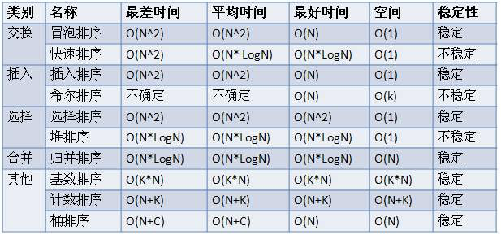

# 排序算法




#### 1、冒泡排序:内部比较排序

```
    /***
     * 1、比较相邻的元素，如果前一个比后一个大，就把它们两个调换位置。
     * 2、对每一对相邻元素作同样的工作，从开始第一对到最后一对，完成后最后的元素最大.
     * 3、针对所有的元素重复以上的步骤，除了最后一个。
     * 4、持续每次对越来越少的元素重复上面的步骤，直到没有任何一对数字需要比较。
     */
    private static void bubbleSort(int[] datas) {
        for (int i = 0; i < datas.length - 1; i++) {
            for (int j = datas.length - 1; j > i; j--) {

                if (datas[j] < datas[j - 1]) {
                    int temp = datas[j];
                    datas[j] = datas[j - 1];
                    datas[j - 1] = temp;
                }
            }
        }
    }

```

#### 2、选择排序：内部比较排序

```
  private static void selectSort(int[] datas) {
        for (int i = 0; i < datas.length - 1; i++) {
            int min = i;
            for (int j = i + 1; j < datas.length; j++) {
                if (datas[j] < datas[min]) {
                    min = j;
                }
            }

            if (min != i) {
                int tmp = datas[i];
                datas[i] = datas[min];
                datas[min] = tmp;
            }
        }
    }
```

#### 3、插入排序

```
    /**
     * 1、从第一个元素开始，该元素可以认为已经被排序
     * 2、取出下一个元素，在已经排序的元素序列中从后向前扫描
     * 3、如果该元素（已排序）大于新元素，将该元素移到下一位置
     * 4、重复步骤3，直到找到已排序的元素小于或者等于新元素的位置
     * 5、将新元素插入到该位置后
     * 6、重复步骤2~5
     */
  private static void insertSort(int[] datas) {
        for (int i = 1; i < datas.length; i++) {

            int target = datas[i];
            int j = i - 1;

            while (j >= 0 && target < datas[j]) {
                datas[j + 1] = datas[j];
                j--;
            }

            datas[j + 1] = target;
        }
    }
```

#### 4、希尔排序：将比较的全部元素分为几个区域来提升插入排序的性能

```
  private static void shellSort(int[] data) {
  
        for (int r = data.length / 2; r >= 1; r = r / 2) {

            for (int i = r; i < data.length; i++) {
                int target = data[i];
                int j = i - r;

                while (j >= 0 && target < data[j]) {
                    data[j + r] = data[j];
                    j -= r;
                }

                data[j + r] = target;
            }
        }
    }

```

#### 5、快速排序：

```
    /**
     * 1、从序列中挑出一个元素，作为”基准”(pivot).
     * 2、把所有比基准值小的元素放在基准前面，所有比基准值大的元素放在基准的后面（相同的数可以到任一边），这个称为分区(partition)操作。
     * 3、对每个分区递归地进行步骤1~2，递归的结束条件是序列的大小是0或1，这时整体已经被排好序了。
     */
    private static void quickSort(int[] data, int low, int high) {
        if (low > high) {
            return;
        }
        int i = low;
        int j = high;
        int index = data[low];

        while (i < j) {
            while (i < j && data[j] >= index) {
                j--;
            }
            if (i < j) {
                data[i] = data[j];
                i++;
            }

            while (i < j && data[i] < index) {
                i++;
            }
            if (i < j) {
                data[j] = data[i];
                j--;
            }
        }

        data[i] = index;

        // 先排序后重复
        quickSort(data, low, i - 1);
        quickSort(data, i + 1, high);
    }
```

#### 6、归并排序：分治算法

```
    /**
     * 1、申请空间，使其大小为两个已经排序序列之和，该空间用来存放合并后的序列
     * 2、设定两个指针，最初位置分别为两个已经排序序列的起始位置
     * 3、比较两个指针所指向的元素，选择相对小的元素放入到合并空间，并移动指针到下一位置
     * 4、重复步骤3直到某一指针到达序列尾
     * 5、将另一序列剩下的所有元素直接复制到合并序列尾
     */
    private static void mergeSort(int[] data, int low, int high) {
        int mid = (low + high) / 2;
        if (low < high) {
            // 左边
            mergeSort(data, low, mid);
            // 右边
            mergeSort(data, mid + 1, high);
            // 左右归并
            merge(data, low, mid, high);
            System.out.println(Arrays.toString(data));
        }
    }

    private static void merge(int[] data, int low, int mid, int high) {
        int[] temp = new int[high - low + 1];

        int i = low;
        int j = mid + 1;
        int k = 0;

        while (i <= mid && j <= high) {
            if (data[i] < data[j]) {
                temp[k++] = data[i++];
            } else {
                temp[k++] = data[j++];
            }

        }
        // 把左边剩余的数移入数组
        while (i <= mid) {
            temp[k++] = data[i++];
        }
        // 把右边边剩余的数移入数组
        while (j <= high) {
            temp[k++] = data[j++];
        }

        for (int k2 = 0; k2 < temp.length; k2++) {
            data[k2 + low] = temp[k2];
        }

    }

```


#### 7、堆排序

```
    /**
     * 由输入的无序数组构造一个最大堆，作为初始的无序区
     * 把堆顶元素（最大值）和堆尾元素互换
     * 把堆（无序区）的尺寸缩小1，并调用heapify(A, 0)从新的堆顶元素开始进行堆调整
     * 重复步骤2，直到堆的尺寸为1
     */
    private static void heapSort(int[] data) {
        for (int i = data.length / 2 - 1; i >= 0; i--) {
            maxHeapDown(data, i, data.length - 1);
        }

        for (int i = data.length - 1; i > 0; i--) {
            int tmp = data[0];
            data[0] = data[i];
            data[i] = tmp;
            maxHeapDown(data, 0, i - 1);
        }
    }

    // 调整一个顶点数据使其成为最大堆
    public static void maxHeapDown(int[] a, int start, int end) {
        int c = start;            // 当前(current)节点的位置
        int l = 2 * c + 1;        // 左(left)孩子的位置
        int tmp = a[c];            // 当前(current)节点的大小

        for (; l <= end; c = l, l = 2 * l + 1) {
            // "l"是左孩子，"l+1"是右孩子
            if (l < end && a[l] < a[l + 1]) {
                l++;        // 左右两孩子中选择较大者，即m_heap[l+1]
            }
            if (tmp >= a[l]) {
                break;        // 调整结束
            } else {            // 交换值
                a[c] = a[l];
                a[l] = tmp;
            }
        }
    }
```

#### 8、计数排序

```
    /**
     * 计数排序：
     * 用待排序的数作为计数数组的下标，统计每个数字的个数。然后依次输出即可得到有序序列
     * <p>
     * 桶排序
     * 基数排序是一种借助多关键字排序思想对单逻辑关键字进行排序的方法。
     */
    private static void countSort(int[] data) {
        int max = Integer.MIN_VALUE;
        int min = Integer.MAX_VALUE;
        for (int i = 0; i < data.length; i++) {
            max = Math.max(max, data[i]);
            min = Math.min(min, data[i]);
        }
        int[] b = new int[data.length];
        int[] count = new int[max - min + 1];

        for (int num = min; num <= max; num++) {
            count[num - min] = 0;
        }

        for (int i = 0; i < data.length; i++) {
            int num = data[i];
            count[num - min]++;
        }

        for (int i = min + 1; i <= max; i++) {
            count[i - min] += count[i - min - 1];
        }

        for (int i = 0; i < data.length; i++) {
            int num = data[i];
            int index = count[num - min] - 1;
            b[index] = num;
            count[num - min]--;
        }

        for (int i = 0; i < data.length; i++) {
            data[i] = b[i];
        }
    }
```


#### 9、二分查找：

```
    /**
     * 与mid进行比较：>mid low=mid+1 <mid high=mid-1 =mid return
     */
    private static int binarySearch(int[] datas, int target) {
        int low = 0;
        int high = datas.length - 1;

        while (low < high) {
            int mid = (low + high) / 2;
            if (target == datas[mid]) {
                return mid;
            }

            if (target < datas[mid]) {
                high = mid - 1;
            }

            if (target > datas[mid]) {
                low = mid + 1;
            }
        }
        return -1;

    }
```


