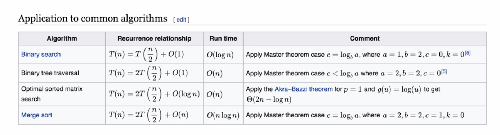

# 数据结构




## 数组/链表
---

```
  public class ListNode {
      int val;
      ListNode next;

      ListNode(int x) {
          val = x;
      }
  }
```

206、reverse-linked-list(反转链表)：1)prev节点 curr节点， 两个节点一组遍历   2)递归

24、swap-nodes-in-pairs(两两交换链表)： 1)prev节点 curr节点， 四个节点一组遍历    2)递归

141、linked-list-cycle(环形链表)：借助Set实现

142、linked-list-cycle-ii(环形链表)：快慢双指针

25、reverse-nodes-in-k-group(k个一组翻转链表)：链表区分为已翻转部分+待翻转部分+未翻转部分


## 堆栈/队列
---

20、valid-parentheses(有效的括号)：堆栈实现

232、implement-queue-using-stacks(栈实现队列)：利用输入栈+输出栈实现队列，offer,poll,peek,

225、implement-stack-using-queues(队列实现栈)：利用输入队列+输出队列实现栈，push,pop

703、kth-largest-element-in-a-stream(第K大元素)：利用优先队列实现，默认poll()最小值，优先队列时间复杂度logK,

239、sliding-window-maximum(滑动窗口最大值)：1）优先队列实现  2）队列实现，保存头节点下标

## 哈希表
---

1、two-sum(两数之和)：哈希表实现

15、3sum：先排序+双指针实现

## 树/二叉树
---

```
  public class TreeNode {
      public TreeNode left;
      public TreeNode right;
      public int val;

      TreeNode(int val) {
          this.val = val;
      }
  }
```

平衡二叉搜索树时间复杂度：logN

98、validate-binary-search-tree(二叉搜索树判断)：1）递归  2）中序遍历

235、lowest-common-ancestor-of-a-binary-tree(公共祖先)：递归左右子树遍历 findPorQ(root, p, q)

树的遍历：前序 —— 中序 —— 后序

深度优先遍历——广度优先遍历


