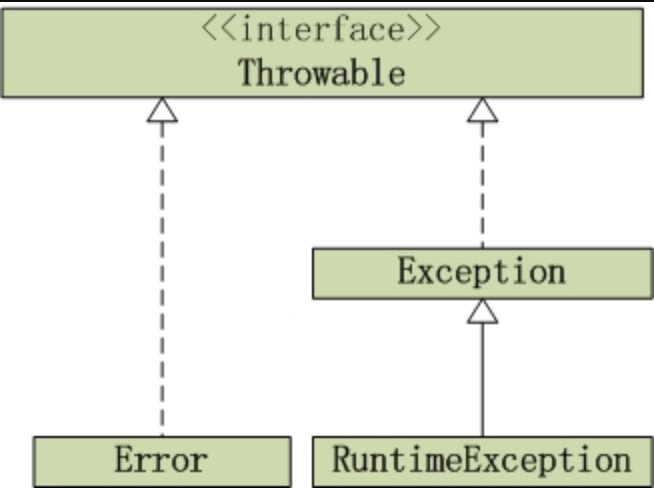
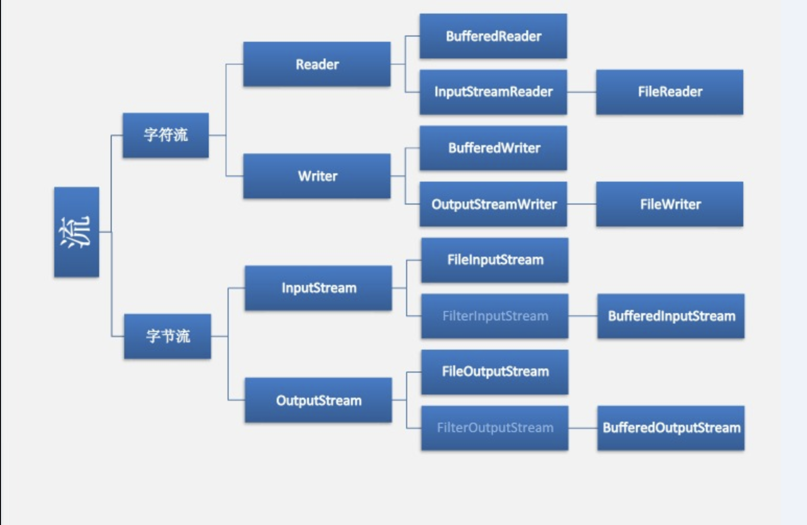

# Java基础知识
## 基本数据类型
---
八种数据类型：int(4) ,double ,long ,float, short,byte,char(2),boolean

switch参数：只支持能转换为int，enum或String的类型

## Object方法
---

**1、equals()：** equals与==区别，子类重写方法

**2、hashCode()：** 用于哈希查找，减少equals次数

**3、toString()：** 将对象转换为字符串

**4、getClass()：** final方法，获取运行时类型

**5、clone()：** 实现对象浅复制，对象必须实现Cloneable接口

**6、finalize()：** 用于释放对象资源，调用失去不确定

**7、wait(),notify(),notifyAll():** 见并发编程

## 异常 (try catch finally)
---

## 面向对象
---
**继承/封装/多态**

**重写/重载的区别**

**内部类**
成员内部类：相当于外部类的成员，持有外部类引用，可以直接访问外部类成员，不能声明static成员

匿名内部类：没有类名的局部内部类，可以访问方法内的局部变量和方法参数（默认增加final修饰）

静态内部类：不持有外部类引用，无法访问外部类的非静态成员

## 反射
---
**Class类**

| 方法 | 用途|
|----|----|
|forName(String className) | 根据类名获取类的对象|
|newInstance()|创建类的实例|
|getClasses()|返回公共类和接口类对象|
|getDeclaredClasses()|返回所有类和接口类的对象|
|getName()|获取类的名字|
|--|--|
|getFiled(String name)|获得某个公有的属性对象|
|getFileds()|获得某个公有的属性对象|
|getDeclaredField(String name)|	获得某个属性对象|
|getDeclaredFields()|获得所有属性对象|
|--|--|
|getConstructor(Class...<?> parameterTypes)|	获得该类中与参数类型匹配的公有构造方法|
|getMethod(String name, Class...<?> parameterTypes)|	获得该类某个公有的方法
|getAnnotation(Class<A> annotationClass)|	返回该类中与参数类型匹配的公有注解对象

**Method类：** invoke(Object obj, Object... args)

**Field类：** equals() get() set()

**Custructor类:**  newInstance(Object... initargs)

**setAccessible():**  设置可访问性

## 注解
---
@interface：修饰注解

1.@Target	注解用于什么地方

CONSTRUCTOR: 用于描述构造器
FIELD:用于描述域
LOCAL_VARIABLE:用于描述局部变量
METHOD:用于描述方法
PACKAGE:用于描述包
PARAMETER:用于描述参数
TYPE:用于描述类、接口(包括注解类型) 或enum声明

2.@Retention	什么时候使用该注解

SOURCE:在源文件中有效（即源文件保留），在编译时将其抛弃掉。
CLASS:在class文件中有效（即class保留），不会添加载到JVM中
RUNTIME:在运行时有效（即运行时保留）

3.@Documented	注解是否将包含在JavaDoc中

4.@Inherited	是否允许子类继承该注解，表示父类如果添加此注解，子类也可以使用

5.@Repeatable	java8添加的，可重复的，表该注解可以多次使用

## 强软弱虚引用
---

1、软引用：SoftReference\<T\>  OOM回收

2、弱引用：WeakReference\<T\>  GC回收

3、虚引用

4、引用队列：ReferenceQueue待回收队列

## String源码分析
---

String对象是不可变类型，实现了Serializable, Comparable, CharSequence接口。

private final char value[]; Android通过runtime管理

private int hash; 使用系统时间，String类地址，System地址得到hash种子

==，euqals(),hashCode区别 

intern():  native调用常量池查找等值对象

## IO流
---

**文件读取：** FileReader FileInputStream 
**文件写入：** FileWritter FileOutputStream 

InputStreamReader：以文本方式输入/输出 new InputStreamReader(FileInputStream)
BufferReader：缓冲式文本读取，readline()方法，new BufferReader(InputStreamReader)
BufferedInputStream:缓冲读写字节流，flush()方法，new BufferInputStream(FileInputStream)

