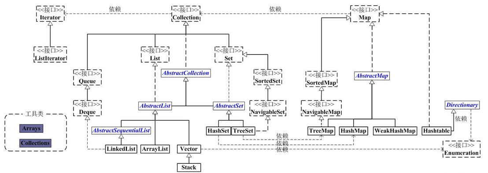

# 集合容器
---


## ArrayList源码
---

1、实现list<E>/RandomAccess/Cloneable/Serializable接口
 
  Object[] elementData 基于动态数组实现，默认为空

**2、构造方法：**  默认为空，初次添加时设置为10
```
    public ArrayList(int initialCapacity)
    public ArrayList(Collection<? extends E> c)
    public ArrayList() {
        this.elementData = DEFAULTCAPACITY_EMPTY_ELEMENTDATA;
    }
```


**3、添加方法：** 先进行扩容判断，然后复制数组，index置为相应value

grow(): 扩容方法,扩容至size+size>>1  调用Arrays.copy()复制数组

System.arraycopy(): native方法复制数组

toArray()：转换为数组，addAll()调用该方法

```
    public void add(int index, E element) {
        ensureCapacityInternal(size + 1);  // Increments modCount!!
        System.arraycopy(elementData, index, elementData, index + 1,
                         size - index);
        elementData[index] = element;
        size++;
    }
    
    // 扩容判断方法
    private void ensureExplicitCapacity(int minCapacity) {
        modCount++;
        if (minCapacity - elementData.length > 0)
            grow(minCapacity);
    }
    
    public Object[] toArray() {
        return Arrays.copyOf(elementData, size);
    }
```


**4、查询方法：** 遍历查询
``` 
    public int indexOf(Object o) {
        if (o == null) {
            for (int i = 0; i < size; i++)
                if (elementData[i]==null)
                    return i;
        } else {
            for (int i = 0; i < size; i++)
                if (o.equals(elementData[i]))
                    return i;
        }
        return -1;
    }
    
    //遍历方法：listIterator()方法返回ListIterator内部类
    public ListIterator<E> listIterator() {
        return new ListItr(0);
    }
```


**5、移除方法：** 通过Systemarraycopy()方法复制数组，然后末尾置null
```
  public E remove(int index) {
        modCount++;
        E oldValue = (E) elementData[index];

        int numMoved = size - index - 1;
        if (numMoved > 0)
            System.arraycopy(elementData, index+1, elementData, index,
                             numMoved);
        elementData[--size] = null; // clear to let GC do its work

        return oldValue;
    }
```

## LinkedList源码
---

1、实现List/Deque/Cloneable/Serializable接口
  
  Stack方法：push(), pop()
  
  Queue/Deque方法：offer/offerFirst/OfferLast  poll()  peek()
  
  Node<E> first,last：双向链表
  
  ```
    private static class Node<E> {
        E item;
        Node<E> next;
        Node<E> prev;
    }
  ```

**2、添加方法：** 添加first，添加last，添加before

```
    private void linkFirst(E e) {
        final Node<E> f = first;
        final Node<E> newNode = new Node<>(null, e, f);
        first = newNode;
        if (f == null)
            last = newNode;
        else
            f.prev = newNode;
        size++;
        modCount++;
    }

    void linkLast(E e) 

    void linkBefore(E e, Node<E> succ)
```

**3、移除方法：** 移除first，移除last，移除指定节点

```
    private E unlinkFirst(Node<E> f) {
        final E element = f.item;
        final Node<E> next = f.next;
        f.item = null;
        f.next = null; // help GC
        first = next;
        if (next == null)
            last = null;
        else
            next.prev = null;
        size--;
        modCount++;
        return element;
    }

    private E unlinkLast(Node<E> l) 

    E unlink(Node<E> x) 
    
```

**4、查询方法：** 遍历查询方法
```
    public int indexOf(Object o) {
        int index = 0;
        if (o == null) {
            for (Node<E> x = first; x != null; x = x.next) {
                if (x.item == null)
                    return index;
                index++;
            }
        } else {
            for (Node<E> x = first; x != null; x = x.next) {
                if (o.equals(x.item))
                    return index;
                index++;
            }
        }
        return -1;
    }
    
    // 遍历：listIterator()方法返回ListIterator内部类
    public ListIterator<E> listIterator(int index) {
        checkPositionIndex(index);
        return new ListItr(index);
    }
```


## Itreator源码
---

HasNext()：集合是否还有下一个元素

next()：获取集合下一个元素

remove()：删除返回的最后一个元素，自动调用一次next()

forEachRemaining()：对每个元素执行给定操作


## HashMap源码
---

**1、通过数组+单向链表实现**

```
    static class Node<K,V> implements Map.Entry<K,V> {
        final int hash;
        final K key;
        V value;
        Node<K,V> next;
        
        public final int hashCode() {
            return Objects.hashCode(key) ^ Objects.hashCode(value);
        }
    }
    
    // 初始化大小
    static final int DEFAULT_INITIAL_CAPACITY = 1 << 4; // 16

    // 加载因子
    static final float DEFAULT_LOAD_FACTOR = 0.75f;
    
    transient Node<K,V>[] table;

    transient Set<Map.Entry<K,V>> entrySet;
    
```

**2、构造方法：** HashMap()   HashMap(int)    HashMap(int, float)

```
  // 容量计算：取该数下一个2的n次幂的值
  static final int tableSizeFor(int cap) {
        int n = cap - 1;
        n |= n >>> 1;
        n |= n >>> 2;
        n |= n >>> 4;
        n |= n >>> 8;
        n |= n >>> 16;
        return (n < 0) ? 1 : (n >= MAXIMUM_CAPACITY) ? MAXIMUM_CAPACITY : n + 1;
    }

```

**3、查询方法：** hash(key)定位桶位置，链表或者树查找

```
    public V get(Object key) {
        Node<K,V> e;
        return (e = getNode(hash(key), key)) == null ? null : e.value;
    }

    final Node<K,V> getNode(int hash, Object key) {
        Node<K,V>[] tab; Node<K,V> first, e; int n; K k;
        
        // 1. 定位键值对所在桶的位置：通过(n - 1) & hash对length取余
        if ((tab = table) != null && (n = tab.length) > 0 &&
            (first = tab[(n - 1) & hash]) != null) {
            
            if (first.hash == hash && 
                ((k = first.key) == key || (key != null && key.equals(k))))
                return first;
                
            if ((e = first.next) != null) {
                // 2. 如果 first 是 TreeNode 类型，则调用黑红树查找方法
                if (first instanceof TreeNode)
                    return ((TreeNode<K,V>)first).getTreeNode(hash, key);
                // 2. 对链表进行查找
                do {
                    if (e.hash == hash &&
                        ((k = e.key) == key || (key != null && key.equals(k))))
                        return e;
                } while ((e = e.next) != null);
            }
        }
        return null;
    }
    
    // Hash方法：由于length比较小，通过hash ^ (hash >>> 16) 让高16位参与增加hash的复杂性
    static final int hash(Object key) {
        int h;
        return (key == null) ? 0 : (h = key.hashCode()) ^ (h >>> 16);
    }
    
```

**4、遍历方法：** 通过keySet, entrySet 遍历Map

KeyIterator 继承自HashIterator，nextNode()方法按顺序查找非空数组，遍历相应列表

```
    final class KeyIterator extends HashIterator
        implements Iterator<K> {
        public final K next() { return nextNode().key; }
    }
```

**5、添加方法：** 通过hash(key)计算桶位置，链表或者红黑树插入，如果重复则覆盖，最后进行扩容判断

```
    public V put(K key, V value) {
        return putVal(hash(key), key, value, false, true);
    }
    
    final V putVal(int hash, K key, V value, boolean onlyIfAbsent,
                   boolean evict) {
        Node<K,V>[] tab; Node<K,V> p; int n, i;
        
        // 如果table为空则初始化桶数组
        if ((tab = table) == null || (n = tab.length) == 0)
            n = (tab = resize()).length;
        // 如果桶数组位置为空，直接插入新链表节点
        if ((p = tab[i = (n - 1) & hash]) == null)
            tab[i] = newNode(hash, key, value, null);
            
        else {
            Node<K,V> e; K k;
            // 如果键的值以及节点 hash 等于链表中的第一个键值对节点时，则将 e 指向该键值对
            if (p.hash == hash &&
                ((k = p.key) == key || (key != null && key.equals(k))))
                e = p;
            else if (p instanceof TreeNode)
                // 如果桶中的引用类型为 TreeNode，则调用红黑树的插入方法
                e = ((TreeNode<K,V>)p).putTreeVal(this, tab, hash, key, value);
                
            else {
                // 对链表进行遍历，并统计链表长度
                for (int binCount = 0; ; ++binCount) {
                    if ((e = p.next) == null) {
                        p.next = newNode(hash, key, value, null);
                        if (binCount >= TREEIFY_THRESHOLD - 1) // -1 for 1st
                            treeifyBin(tab, hash);
                        break;
                    }
                    // 如果链表长度大于或等于树化阈值，则进行树化操作
                    if (e.hash == hash &&
                        ((k = e.key) == key || (key != null && key.equals(k))))
                        break;
                    p = e;
                }
            }
            
            // 判断要插入的键值对是否存在 HashMap中，重复则用插入值进行覆盖
            if (e != null) { // existing mapping for key
                V oldValue = e.value;
                if (!onlyIfAbsent || oldValue == null)
                    e.value = value;
                afterNodeAccess(e);
                return oldValue;
            }
        }
        ++modCount;
        
        // 键值对数量超过阈值时，则进行扩容
        if (++size > threshold)
            resize();
        afterNodeInsertion(evict);
        return null;
    }

```
**6、扩容方法：** 计算新容量和新阈值，创建新的桶数组并复制旧数组（树需要拆分）

```
    final Node<K,V>[] resize() {
        Node<K,V>[] oldTab = table;
        int oldCap = (oldTab == null) ? 0 : oldTab.length;
        int oldThr = threshold;
        int newCap, newThr = 0;
        // 1、计算新容量和新阈值
        if (oldCap > 0) {
            if (oldCap >= MAXIMUM_CAPACITY) {
                threshold = Integer.MAX_VALUE;
                return oldTab;
            }
            else if ((newCap = oldCap << 1) < MAXIMUM_CAPACITY &&
                     oldCap >= DEFAULT_INITIAL_CAPACITY)
                newThr = oldThr << 1; // 双倍扩容
        }
        
        else if (oldThr > 0) // initial capacity was placed in threshold
            newCap = oldThr;
        else {               // zero initial threshold signifies using defaults
            newCap = DEFAULT_INITIAL_CAPACITY;
            newThr = (int)(DEFAULT_LOAD_FACTOR * DEFAULT_INITIAL_CAPACITY);
        }
        if (newThr == 0) {
            float ft = (float)newCap * loadFactor;
            newThr = (newCap < MAXIMUM_CAPACITY && ft < (float)MAXIMUM_CAPACITY ?
                      (int)ft : Integer.MAX_VALUE);
        }
        
        // 2、创建新的桶数组
        Node<K,V>[] newTab = (Node<K,V>[])new Node[newCap];
        table = newTab;
        if (oldTab != null) {
            
            // 3、如果旧的桶数组不为空，则遍历桶数组，并将键值对映射到新的桶数组中
            for (int j = 0; j < oldCap; ++j) {
                Node<K,V> e;
                if ((e = oldTab[j]) != null) {
                    oldTab[j] = null;
                    if (e.next == null)
                        newTab[e.hash & (newCap - 1)] = e;
                    else if (e instanceof TreeNode)
                        // 重新映射时，需要对红黑树进行拆分
                        ((TreeNode<K,V>)e).split(this, newTab, j, oldCap);
                    else { 
                        // 遍历链表，并将链表节点按原顺序进行分组
                        // 将分组后的链表映射到新桶中
                        ... ...
                    }
                }
            }
        }
        return newTab;
    }
```

**7、红黑树：** 继承Node， 默认保存next引用， 可直接转换为链表

```
static final class TreeNode<K,V> extends LinkedHashMap.Entry<K,V> {
    TreeNode<K,V> parent;  // red-black tree links
    TreeNode<K,V> left;
    TreeNode<K,V> right;
    TreeNode<K,V> prev;    // needed to unlink next upon deletion
    boolean red;
    TreeNode(int hash, K key, V val, Node<K,V> next) {
        super(hash, key, val, next);
    }
}

// 红黑树生成算法，大于8桶容量大于64  （拆分小于6）
final void treeifyBin(Node<K,V>[] tab, int hash) {
    int n, index; Node<K,V> e;
    // 桶数组容量小于 MIN_TREEIFY_CAPACITY，优先进行扩容而不是树化
    if (tab == null || (n = tab.length) < MIN_TREEIFY_CAPACITY)
        resize();
    else if ((e = tab[index = (n - 1) & hash]) != null) {
        // hd 为头节点（head），tl 为尾节点（tail）
        TreeNode<K,V> hd = null, tl = null;
        do {
            // 将普通节点替换成树形节点
            TreeNode<K,V> p = replacementTreeNode(e, null);
            if (tl == null)
                hd = p;
            else {
                p.prev = tl;
                tl.next = p;
            }
            tl = p;
        } while ((e = e.next) != null);  // 将普通链表转成由树形节点链表
        if ((tab[index] = hd) != null)
            // 将树形链表转换成红黑树
            hd.treeify(tab);
    }
}
```

**8、删除方法：** hash(key) 定位桶位置，查找链表或红黑树删除节点，删除并修复红黑树和链表

```
  public V remove(Object key) {
      Node<K,V> e;
      return (e = removeNode(hash(key), key, null, false, true)) == null ?
          null : e.value;
  }

final Node<K,V> removeNode(int hash, Object key, Object value,
                           boolean matchValue, boolean movable) {
    Node<K,V>[] tab; Node<K,V> p; int n, index;
    if ((tab = table) != null && (n = tab.length) > 0 &&
        // 1. 定位桶位置
        (p = tab[index = (n - 1) & hash]) != null) {
        Node<K,V> node = null, e; K k; V v;
        // 如果键的值与链表第一个节点相等，则将 node 指向该节点
        if (p.hash == hash &&
            ((k = p.key) == key || (key != null && key.equals(k))))
            node = p;
        else if ((e = p.next) != null) {  
            
            // 如果是 TreeNode 类型，调用红黑树的查找逻辑定位待删除节点
            if (p instanceof TreeNode)
                node = ((TreeNode<K,V>)p).getTreeNode(hash, key);
            else {
                // 2. 遍历链表，找到待删除节点
                do {
                    if (e.hash == hash &&
                        ((k = e.key) == key ||
                         (key != null && key.equals(k)))) {
                        node = e;
                        break;
                    }
                    p = e;
                } while ((e = e.next) != null);
            }
        }
        
        // 3. 删除节点，并修复链表或红黑树
        if (node != null && (!matchValue || (v = node.value) == value ||
                             (value != null && value.equals(v)))) {
            if (node instanceof TreeNode)
                ((TreeNode<K,V>)node).removeTreeNode(this, tab, movable);
            else if (node == p)
                tab[index] = node.next;
            else
                p.next = node.next;
            ++modCount;
            --size;
            afterNodeRemoval(node);
            return node;
        }
    }
    return null;
}
```

## TreeMap源码
---
1、继承NavigableMap接口，通过红黑树实现有序Key

二叉查找树：左子树所有节点均小于根节点，右子树所有节点均大于根节点，中序遍历可得到顺序序列

```
  static final class Entry<K,V> implements Map.Entry<K,V> {
      K key;
      V value;
      // 左孩子节点
      Entry<K,V> left = null;
      // 右孩子节点
      Entry<K,V> right = null;
      // 父节点
      Entry<K,V> parent;
      // 红黑树用来表示节点颜色的属性，默认为黑色
      boolean color = BLACK;
  }
```

**2、添加，删除，查询方法：** 新插入红色节点，左旋右旋变色调整平衡性


## HashSet/TreeSet
---

**HashSet/TreeSet 基于HashMap/TreeMap实现，不再具体说明**


## LinkedHashMap
---

1、继承HashMap，基于链表和HashMap实现


```
    // Entry继承自HashMap.Node，包含before, after节点
    static class LinkedHashMapEntry<K,V> extends HashMap.Node<K,V> {
        LinkedHashMapEntry<K,V> before, after;
        LinkedHashMapEntry(int hash, K key, V value, Node<K,V> next) {
            super(hash, key, value, next);
        }
    }
    
    // 用于指向双向链表的头部
    transient LinkedHashMap.Entry<K,V> head;
    //用于指向双向链表的尾部
    transient LinkedHashMap.Entry<K,V> tail;
```

**2、构造方法：** 调用HashMap构造方法

```
    public LinkedHashMap(int initialCapacity,
                         float loadFactor,
                         boolean accessOrder) {
        super(initialCapacity, loadFactor);
        this.accessOrder = accessOrder;
    }
  
    // 用来指定LinkedHashMap的迭代顺序
    // true则表示按照基于访问的顺序来排列, false则表示按照插入顺序来
    final boolean accessOrder;
```

**3、添加方法：** 调用HashMap put()方法，LinkedHashMap重写部分方法，（子类可重写removeEldestEntry判断是否删除节点）

```
    final V putVal(int hash, K key, V value, boolean onlyIfAbsent,
                       boolean evict) {
        ...
        // 重写newNode()方法
        tab[i] = newNode(hash, key, value, null);
        ...
        e = ((TreeNode<K,V>)p).putTreeVal(this, tab, hash, key, value);
        ...
        // 覆盖则调用节点访问方法
        if ((e = p.next) == null) {
          p.next = newNode(hash, key, value, null);
          afterNodeAccess(e);
        ...
        afterNodeInsertion(evict);
        return null;
    }
    
    // 创建LinkedHashMapEntry，并将节点添加至链表的最后
    Node<K,V> newNode(int hash, K key, V value, Node<K,V> e) {
        LinkedHashMapEntry<K,V> p =
            new LinkedHashMapEntry<K,V>(hash, key, value, e);
        linkNodeLast(p);
        return p;
    }
    
    // 添加节点后回调，是否删除节点
    void afterNodeInsertion(boolean evict) { // possibly remove eldest
        LinkedHashMapEntry<K,V> first;
        
        // removeEldestEntry()用于子类重写，是否需要删除节点
        if (evict && (first = head) != null && removeEldestEntry(first)) {
            K key = first.key;
            removeNode(hash(key), key, null, false, true);
        }
    }
    
```

**3、查询方法：** 通过HashMap.getNode()方法获取节点，然后判断是否访问排序（将节点移动到最后）

```
    public V get(Object key) {
        Node<K,V> e;
        if ((e = getNode(hash(key), key)) == null)
            return null;
        if (accessOrder)
            afterNodeAccess(e);
        return e.value;
    }
    
    // 节点访问后回调，是否移动节点到最后
    void afterNodeAccess(Node<K,V> e) { // move node to last
        LinkedHashMapEntry<K,V> last;
        if (accessOrder && (last = tail) != e) {
            LinkedHashMapEntry<K,V> p =
                (LinkedHashMapEntry<K,V>)e, b = p.before, a = p.after;
            p.after = null;
            if (b == null)
                head = a;
            else
                b.after = a;
            if (a != null)
                a.before = b;
            else
                last = b;
            if (last == null)
                head = p;
            else {
                p.before = last;
                last.after = p;
            }
            tail = p;
            ++modCount;
        }
    }
    
```

**4、删除方法：** // 调用HashMap remove()方法，然后删除链表相应节点

```
  // 调用HashMap remove()方法
  final Node<K,V> removeNode(int hash, Object key, Object value,
                             boolean matchValue, boolean movable) {
        ...
        afterNodeRemoval(node);
        ...
  }
  // 节点删除后回调，删除链表对应节点
  void afterNodeRemoval(Node<K,V> e) { // unlink
        LinkedHashMapEntry<K,V> p =
            (LinkedHashMapEntry<K,V>)e, b = p.before, a = p.after;
        p.before = p.after = null;
        if (b == null)
            head = a;
        else
            b.after = a;
        if (a == null)
            tail = b;
        else
            a.before = b;
    }
```


## SpareArray
---

**1、SpareArray（离散数组）：**

SpareArray (int Object) , LongSparseArray (long Object)

SpareBooleanArray (int boolean) , SparseIntArray (int int) , SparseLongArray (int long)

ArrayMap (object object) , ArraySet (object)   (通过key的hash值转换为int Object类型)

**2、SpareArray实现：** 基于key valuse数组

```
    // 标志是否删除
    private static final Object DELETED = new Object();
    // 标记是否需要垃圾回收
    private boolean mGarbage = false;
    
    // 有序key数组
    private int[] mKeys;
    private Object[] mValues;
    private int mSize;

```

**3、添加方法：**  二分查找位置（为空则直接覆盖），垃圾回收并重新计算位置，通过GrowingArrayUtils实现插入

```
    public void append(int key, E value) {
        if (mSize != 0 && key <= mKeys[mSize - 1]) {
            //当mSize不为0并且不大于mKeys数组中的最大值时，执行put方法
            put(key, value);
            return;
        }
        //当垃圾回收标志mGarbage为true并且当前元素已经占满整个数组，执行gc进行空间压缩
        if (mGarbage && mSize >= mKeys.length) {
            gc();
        }
        
        //在数组最后一个位置插入元素，通过System.arraycopy()实现，扩容size*2
        mKeys = GrowingArrayUtils.append(mKeys, mSize, key);
        mValues = GrowingArrayUtils.append(mValues, mSize, value);
        mSize++;
    }  
    
    public void put(int key, E value) {
        int i = ContainerHelpers.binarySearch(mKeys, mSize, key);
        
        if (i >= 0) {
            mValues[i] = value;
        } else {
            i = ~i;
            //元素要添加的位置正好==DELETED，直接覆盖
            if (i < mSize && mValues[i] == DELETED) {
                mKeys[i] = key;
                mValues[i] = value;
                return;
            }
            //垃圾回收
            if (mGarbage && mSize >= mKeys.length) {
                gc();
                //重新计算插入的位置
                i = ~ContainerHelpers.binarySearch(mKeys, mSize, key);
            }
            
            //在指定位置i处插入元素，通过System.arraycopy()实现，扩容size*2
            mKeys = GrowingArrayUtils.insert(mKeys, mSize, i, key);
            mValues = GrowingArrayUtils.insert(mValues, mSize, i, value);
            mSize++;
        }
    }
    
     static int binarySearch(int[] array, int size, int value) {
        int lo = 0;
        int hi = size - 1;

        while (lo <= hi) {
            final int mid = (lo + hi) >>> 1;
            final int midVal = array[mid];

            if (midVal < value) {
                lo = mid + 1;
            } else if (midVal > value) {
                hi = mid - 1;
            } else {
                return mid;  
            }
        }
        return ~lo;  // 未找到返回 lo 取反
    }
```

**4、删除方法：** 二分查找位置，相应位置置DELETED，mGarbage置为true

```
  public void delete(int key) {
        int i = ContainerHelpers.binarySearch(mKeys, mSize, key);

        if (i >= 0) {
            if (mValues[i] != DELETED) {
                mValues[i] = DELETED;
                mGarbage = true;
            }
        }
    }
    
    private void gc() {
        int n = mSize;
        int o = 0;
        int[] keys = mKeys;
        Object[] values = mValues;

        // 复制到新数组
        for (int i = 0; i < n; i++) {
            Object val = values[i];
            if (val != DELETED) {
                if (i != o) {
                    keys[o] = keys[i];
                    values[o] = val;
                    values[i] = null;
                }
                o++;
            }
        }
        mGarbage = false;
        mSize = o;
    }
```

**5、其它方法**

indexofKey(key), indexofValue(value)

keyAt(index), valueAt(index)


## ConcurrentHashMap
----
1、实现原理

1.7 之前采用分段锁（Segment），并发度为segment个数(默认16)，put时通过tryLock获取分段锁

1.8 通过unSafe+synchronized+volatile同步，底层依然由数组+链表+红黑树实现

```
    private static final int MAXIMUM_CAPACITY = 1 << 30;
    private static final int DEFAULT_CAPACITY = 16;
    static final int TREEIFY_THRESHOLD = 8;
    static final int UNTREEIFY_THRESHOLD = 6;
    static final int MIN_TREEIFY_CAPACITY = 64;

    transient volatile Node<K,V>[] table;//默认没初始化的数组，用来保存元素
    private transient volatile Node<K,V>[] nextTable;//扩容的时候用的数组

     // 用来控制表初始化和扩容的，默认值为0
     // 当为正数，表示容量阈值大小（数组的0.75）
     // 当为负的时候，说明表正在初始化或扩张，
     // -1表示初始化，-n表示正在扩容的线程
    private transient volatile int sizeCtl;
    
    // 链表节点
    static class Node<K,V> implements Map.Entry<K,V> {
        final int hash;    //key的hash值
        final K key;       //key
        volatile V val;    //value
        volatile Node<K,V> next; //表示链表中的下一个节点
    }
    
    // 树节点
    static final class TreeNode<K,V> extends Node<K,V> {
        TreeNode<K,V> parent;  // red-black tree links
        TreeNode<K,V> left;
        TreeNode<K,V> right;
        TreeNode<K,V> prev;    // needed to unlink next upon deletion
        boolean red;
    }
    
    // 树的头节点，储存root和first节点
    static final class TreeBin<K,V> extends Node<K,V> {
        TreeNode<K,V> root;
        volatile TreeNode<K,V> first;
        volatile Thread waiter;
        volatile int lockState;
    }
    
    // 扩容时的临时空节点,用于控制并发(标记当前节点是否已转移)
    static final class ForwardingNode<K,V> extends Node<K,V> 
    
    // 通过unSafe方法直接操作内存
    unSafe.getObjectVolatile()
    unSafe.putObjectVolatile()
    unSafe.compareAndSwapObject()
```

**2、构造方法：** 默认值16，通过tableSizeFor()方法计算sizeCtl容量大小

```
    public ConcurrentHashMap(int initialCapacity) {
        if (initialCapacity < 0)
            throw new IllegalArgumentException();
        int cap = ((initialCapacity >= (MAXIMUM_CAPACITY >>> 1)) ?
                   MAXIMUM_CAPACITY :
                   tableSizeFor(initialCapacity + (initialCapacity >>> 1) + 1));
        this.sizeCtl = cap;
    }
    
    // 添加数据时初始化桶数组
    private final Node<K,V>[] initTable() {
        Node<K,V>[] tab; int sc;
        while ((tab = table) == null || tab.length == 0) {   
            // 若有其它线程正在扩容则等待
            if ((sc = sizeCtl) < 0)                            
                Thread.yield(); 
            // CAS设置sizeCtl为-1，初始化桶数组
            else if (U.compareAndSwapInt(this, SIZECTL, sc, -1)) {    
                try {
                    if ((tab = table) == null || tab.length == 0) {
                        int n = (sc > 0) ? sc : DEFAULT_CAPACITY;        
                        @SuppressWarnings("unchecked")
                        Node<K,V>[] nt = (Node<K,V>[])new Node<?,?>[n];
                        table = tab = nt;
                        sc = n - (n >>> 2);
                    }
                } finally {
                    sizeCtl = sc;            
                }
                break;
            }
        }
        return tab;
    }
```

**3、添加方法：** 

1）hash定位桶位置，

2）未初始化则initTable()，

3）桶为空则cas添加数据，

4）非空则synchronized加锁并插入链表或红黑树(>8创建红黑树)

```
    public V put(K key, V value) {
        return putVal(key, value, false);
    }

    final V putVal(K key, V value, boolean onlyIfAbsent) {
        int hash = spread(key.hashCode());
        int binCount = 0;
        for (Node<K,V>[] tab = table;;) {
            Node<K,V> f; int n, i, fh;
            // 初始化table
            if (tab == null || (n = tab.length) == 0)
                tab = initTable();
            else if ((f = tabAt(tab, i = (n - 1) & hash)) == null) {
                // 当前位置为空，则CAS添加数据
                if (casTabAt(tab, i, null,
                             new Node<K,V>(hash, key, value, null)))
                    break;                   
            }
            
            // 如果数组正在扩张复制，当前线程参与复制
            else if ((fh = f.hash) == MOVED)
                tab = helpTransfer(tab, f);
            else {
                 /*
                 * 如果在这个位置有元素的话，就采用synchronized的方式加锁，
                 *    链表遍历，替换或者添加至链表尾部
                 *    红黑树则调用putTreeVal方法添加到树中去
                 */
                V oldVal = null;
                synchronized (f) {
                    if (tabAt(tab, i) == f) {
                          ...
                        else if (f instanceof TreeBin) {
                            ...
                        }
                    }
                }
                
                // 添加完成后，判断是否需要树化
                if (binCount != 0) {
                    if (binCount >= TREEIFY_THRESHOLD)
                        treeifyBin(tab, i);
                    if (oldVal != null)
                        return oldVal;
                    break;
                }
            }
        }
        addCount(1L, binCount);
        return null;
    }
```

**4、扩容操作：** trePresize/helpTransfer/addCount调用

1) 初始化扩容数组，

2) synchronized加锁复制链表或数组

3) 设置已转移节点为ForwardingNode

```
    // 通过synchronized将链表转换为树，桶容量<64则tryPresize扩容
    private final void treeifyBin(Node<K,V>[] tab, int index) {
        Node<K,V> b; int n;
        if (tab != null) {
            if ((n = tab.length) < MIN_TREEIFY_CAPACITY)
                // 桶数组扩容
                tryPresize(n << 1);
            else if ((b = tabAt(tab, index)) != null && b.hash >= 0) {
                synchronized (b) {
                    if (tabAt(tab, index) == b) {
                        TreeNode<K,V> hd = null, tl = null;
                        for (Node<K,V> e = b; e != null; e = e.next) {
                            TreeNode<K,V> p =
                                new TreeNode<K,V>(e.hash, e.key, e.val,
                                                  null, null);
                            if ((p.prev = tl) == null)
                                hd = p;
                            else
                                tl.next = p;
                            tl = p;
                        }
                        setTabAt(tab, index, new TreeBin<K,V>(hd));
                    }
                }
            }
        }
    } 
    
    // 辅助扩容，CAS设置sizeCtl扩容线程+1，(检测节点HASH值为MOVED)
    final Node<K,V>[] helpTransfer(Node<K,V>[] tab, Node<K,V> f) 
    
    // 数组元素发生变化
    private final void addCount(long x, int check)
    
    private final void transfer(Node<K,V>[] tab, Node<K,V>[] nextTab) {
        int n = tab.length, stride;
        if ((stride = (NCPU > 1) ? (n >>> 3) / NCPU : n) < MIN_TRANSFER_STRIDE)
            stride = MIN_TRANSFER_STRIDE; 
            
        // 初始化扩容数组nextTab
        if (nextTab == null) {            
            try {
                @SuppressWarnings("unchecked")
                Node<K,V>[] nt = (Node<K,V>[])new Node<?,?>[n << 1];
                nextTab = nt;
            } catch (Throwable ex) {      // try to cope with OOME
                sizeCtl = Integer.MAX_VALUE;
                return;
            }
            nextTable = nextTab;
            transferIndex = n;
        }
        int nextn = nextTab.length;
        
        // 创建ForwardingNode空节点，控制并发
        ForwardingNode<K,V> fwd = new ForwardingNode<K,V>(nextTab);
        boolean advance = true;
        boolean finishing = false; // to ensure sweep before committing nextTab
        for (int i = 0, bound = 0;;) {
            Node<K,V> f; int fh;
            // 是否继续向前查找
            while (advance) {
                ...
            }
            
            if (i < 0 || i >= n || i + n >= nextn) {
                int sc;
                // 扩容完成，替换旧数据
                if (finishing) {
                    nextTable = null;
                    table = nextTab;
                    sizeCtl = (n << 1) - (n >>> 1);
                    return;
                }
                // 转移完成，CAS设置扩容线程-1
                if (U.compareAndSwapInt(this, SIZECTL, sc = sizeCtl, sc - 1)) {
                    if ((sc - 2) != resizeStamp(n) << RESIZE_STAMP_SHIFT)
                        return;
                    finishing = advance = true;
                    i = n; // recheck before commit
                }
            }
            // CAS操作设置节点为ForwardingNode
            else if ((f = tabAt(tab, i)) == null)
                advance = casTabAt(tab, i, null, fwd);
            else if ((fh = f.hash) == MOVED)
                advance = true; // already processed
            else {
            // 加锁复制链表或红黑树，（红黑树小于6则链表化）
                synchronized (f) {
                    ....
                }
            }
        }
    }
```

**5、多线程同步**

    在ConcurrentHashMap中，同步处理主要是通过Synchronized和unsafe两种方式来完成的。

　　·在取得sizeCtl、某个位置的Node的时候，使用的都是unsafe的方法，来达到并发安全的目的

　　·当需要在某个位置设置节点的时候，则会通过Synchronized的同步机制来锁定该位置的节点。

　　·在数组扩容的时候，则通过处理的步长和fwd节点来达到并发安全的目的，通过设置hash值为MOVED

　　·当把某个位置的节点复制到扩张后的table的时候，也通过Synchronized的同步机制来保证现程安全


## 并发容器：
----

1、CopyOnWriteArrayList：通过Synchronized实现同步机制的数组

2、ConcurrentLinkedQueue：单链表实现，基于循环CAS的非阻塞队列

ConcurrentLinkedDeque：双向链表实现，基于循环CAS的非阻塞队列

3、BlockingQueue：基于lock和condition通知实现的阻塞队列

   （1）ArrayBlockingQueue: 一个由数组结构组成的有界阻塞队列。
   
　　（2）LinkedBlockingQueue: 一个由链表结构组成的有界阻塞队列。
  
　　（3）PriorityBlockingQueue是一个支持优先级的无界阻塞队列。默认情况下元素采取自然顺序升序排列。
  
　　（4）DelayQueue是一个支持延时获取元素的无界阻塞队列，使用PriorityBlockingQueue来实现。
  
　　（5）SynchronousQueue：SynchronousQueue是一个不存储元素的阻塞队列。每一个put操作必须等待一个take操作。
  
　　（6）LinkedTransferQueue：LinkedTransferQueue是一个由链表结构组成的无界阻塞TrtansferQueue队列。
  
　　（7）LinkedBlockingDeque：LinkedBlockingDeque是一个由链表结构组成的双向阻塞队列。


