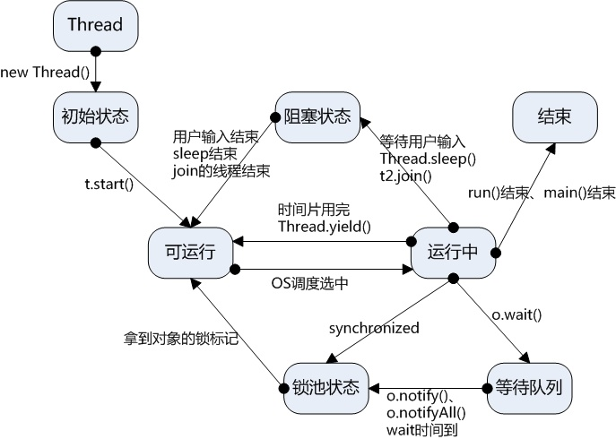
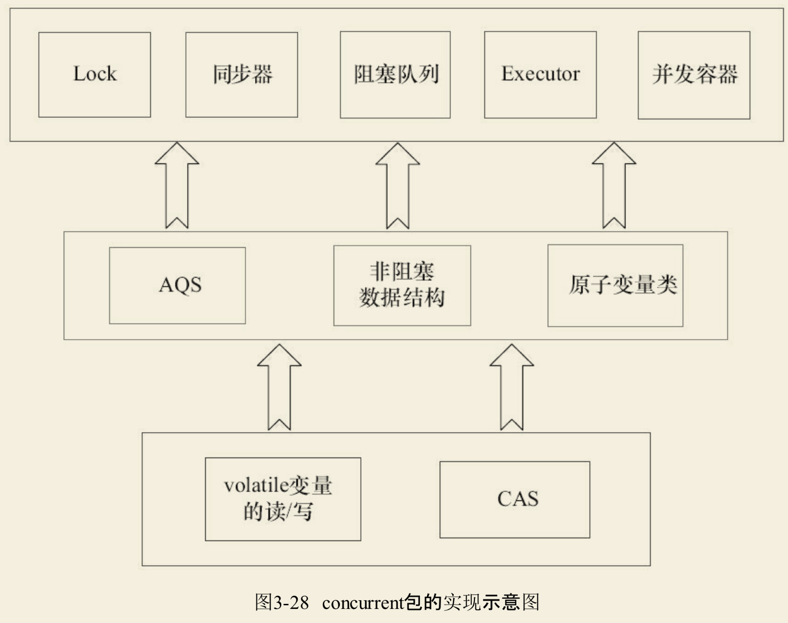
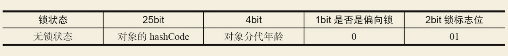
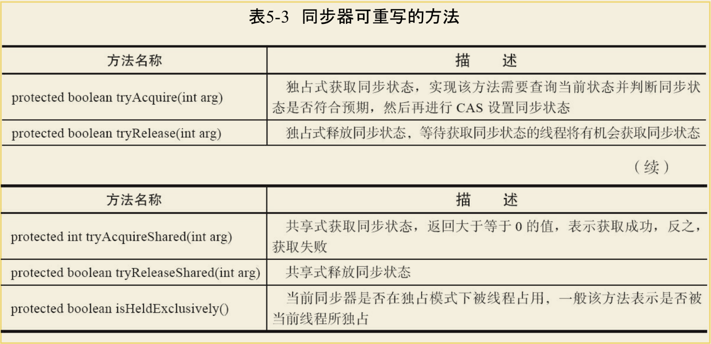
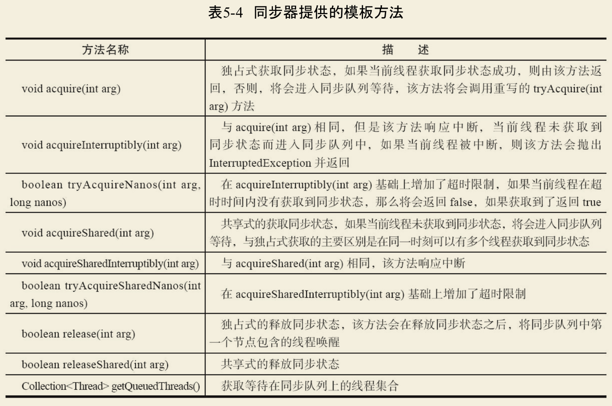
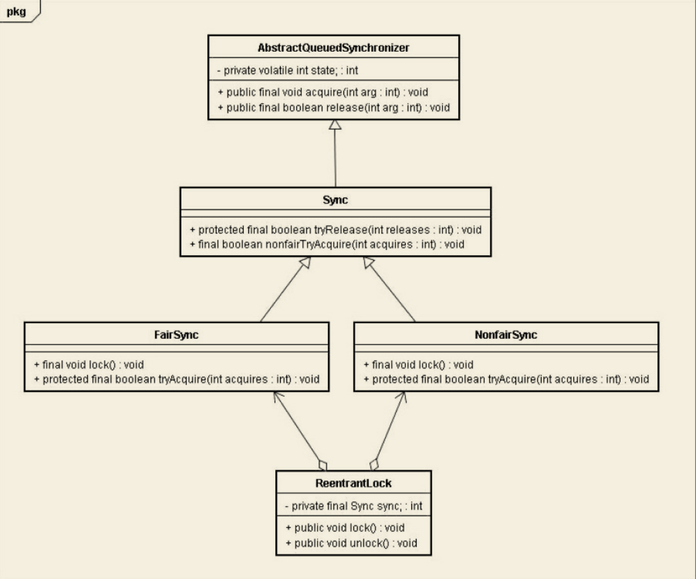

# JAVA并发

## 线程生命周期
---




1、Thread方法：t.start()   t2.join()/Thread.sleep()    Thread.yield()  Thread.interrupted()终止

2、Object方法：o.wait()   o.notify()   o.notifyAll() 

3、ThreadLocal：线程专属变量
  
  每个线程有一个ThreadLocalMap(以ThreadLocal为key，任意对象为值)，由ThreadLocal维护

#### 4、生产者消费者：

```
  public class Storage {
    private final int MAX_SIZE = 10;
    private LinkedList<Object> list = new LinkedList<>();

    public void produce() {
        synchronized (list) {
            while (list.size() + 1 > MAX_SIZE) {
                list.wait();
            }
            list.add(new Object());
            list.notifyAll();
        }
    }

    public void consume() {
        synchronized (list) {
            while (list.size() == 0) {          
                list.wait();
            }
            list.remove();
            list.notifyAll();
        }
    }
  }
  
  public class Storage {
    private final int MAX_SIZE = 10;
    private LinkedList<Object> list = new LinkedList<Object>();
    private final Lock lock = new ReentrantLock();
    private final Condition full = lock.newCondition();
    private final Condition empty = lock.newCondition();

    public void produce()
    {
        lock.lock();
        while (list.size() + 1 > MAX_SIZE) {
            full.await();
        }
        list.add(new Object());
        empty.signalAll();
        lock.unlock();
    }

    public void consume()
    {
        lock.lock();
        while (list.size() == 0) {
            empty.await();
        }
        list.remove();
        full.signalAll();
        lock.unlock();
    }
  }

  // BlockingQueue()  put/take方法实现

```

## 原子操作：volatile，CAS，锁
---

1、CAS：利用CMPXCHG指令实现，同时具有volatile读和volatile写的内存含义

  ABS问题，自旋CAS长时间开销大，只能保证一个共享变量的原子操作
  
  CAS通过unSafe.compareAndSwap() 实现

2、锁：synchronized 或 Lock （Lock基于CAS+volatile实现）

#### 3、Java并发包结构




#### 4、单例模式：双重检查，静态内部类

```
  public class Singleton {
      private static volatile Singleton instance = null;
      private Singleton() { }
      public static Singleton getInstance() {
          if (instance == null) {
              synchronized(Singleton.class) {
                  if (instance == null){
                      instance = new Singleton();
                  }
              }
          }
         return instance; 
      }
  }
  
  private static class SingletonHolder {
      private static StaticSingleton INSTANCE = new StaticSingleton();
  }

```


## volatile
---

1、通过Lock指令实现：Lock指令会引起处理器缓存回写到内存

2、保证变量的可见性：一个线程的缓存回写到内存会导致其他处理器缓存无效

3、防止指令冲排序：增加内存屏障，volatile写之前不重排序，volatile读之后不重排序

      volatile写：之前StoreStore屏障，保证volatile写之前，前面的所有写操作已对任意处理器可见
                之后StoreLoad屏障，避免volatile写之后，与后面可能的volatile读写操作重排序
                
      volatile读：之后LoadLoad屏障，禁止上面的volatile读与下面的普通读重排序
                之后LoadStore屏障，禁止上面的volatile读与下面的普通写重排序

4、复合操作++等不具有原子性

## synchronized
---

1、同步类或对象：JVM 基于进入和退出Monitor对象来实现方法同步和代码块同步

2、锁的状态（存储在对象头中）：无锁状态，偏向锁，轻量级锁，重量级锁

对象头：Mark Word 32bit(锁及hascode信息)，对象指针 32bit，（数组长度 32bit）




## AQS原理
---
1、AQS负责封装同步状态管理，线程排队，等待唤醒等底层操作，锁Lock基于AQS实现

2、AQS通过volatile int变量表示同步状态，内置双向队列完成线程的排队工作

3、修改状态方法：getState() setState(int newState)  compareAndSetState(int expect,int update)

4、子类通过继承同步器并重写其抽象方法来管理同步状态（抽象方法可调用AQS修改状态方法）



5、AQS基于模板方法模式，自定义同步组件（ReentrantLock,ReentrantReadWriteLock）调用模板方法实现同步

包括独占式获取释放同步状态，共享式获取释放同步状态，查询同步队列等待线程三类方法



6、独占式同步状态获取和释放

tryAcquire()：尝试获取同步状态

addWaiter()：获取失败则进入同步队列（通过循环CAS方法设置尾节点）

acquireQueued()：头节点自旋获取同步状态

释放同步状态时通过LockSupport.unpark(thread)唤醒同步队列线程

```
    public final void acquire(int arg) {
        if (!tryAcquire(arg) &&
            acquireQueued(addWaiter(Node.EXCLUSIVE), arg))
                selfInterrupt(); 
    }
    
    public final boolean release(int arg) {
        if (tryRelease(arg)) {
            Node h = head; 
            if (h != null && h.waitStatus != 0)
                unparkSuccessor(h);
                
            return true;     
        }
        return false;
    }
```


## ReentrantLock
---

#### 1、可重入锁，可实现公平锁，选择型通知，trylock超时获取锁，等待可中断

2、ReentrantLock实现

调用流程：lock() -> AQS.acquire() -> tryAcquire() -> nonfairTryAcquire()/修改volatile状态

释放流程：unlock() -> AQS.release() -> tryRelease()



3、ReentrantReadWriteLock：维护了一个读锁readLock，一个写锁writeLock

读写状态的设计：volatile高16读低16写

读锁readLock：支持重进入的排它锁，需重写tryAcquire()方法

写锁writeLock：支持重进入的共享锁，需重写tryAcquireShared()方法

锁降级：写锁降级成为读锁，先持有写锁再获取读锁再释放写锁的过程

4、LockSupport工具：

park()：阻塞当前线程

unpark(thread)：唤醒阻塞线程

5、Condition通知：Lock.newCondition()

await(), awaitUntil()：等待方法

signal(), signalAll()：通知唤醒

基于AQS的ConditionObject实现，CAS维护一个等待队列


## Atomic原子类
---

1、通过CAS+volatile来保证原子操作

CAS操作通过UnSafe类实现：compareAndSwapObject/Int/Long

2、AtomicBoolean，AtomicInteger，AtomicLong常用方法：

addAndGet(),compareAndSet(),getAndIncrement(),lazySet(),getAndSet()

3、原子更新数组/引用/字段


## Android多线程
---

1、AsyncTask

Params参数封装FutureTask，(FutureTask基于AQS实现，get()获取结果)

SerialExecutor执行任务队列：scheduleNext()

THREAD_POOL_EXCUTOR执行任务

2、HanderThread

内部实现：run()中调用Lopper.perpare(),Lopper.loop()

常用方法：start()/quit()。通过Handler交互


#### 3、ThreadPoolExector

内部实现：线程池将线程封装成工作线程Worker，Worker执行成功后循环获取工作队列的任务来执行

常用参数：coresize, 阻塞队列， maxsize，线程工厂， 拒绝策略

  CPU密集型：Ncpu+1， IO密集型：2*Ncpu

常用方法：execute()无返回值，  submit()有返回值

常用线程池：FixThreadPool(n+n)，CachedThreadPool(0+max), SingleThreadPool(1+1)

  ScheduledThreadPool(n+max) 定期执行任务的线程池

线程池监控：重写beforeExecute、afterExecute和terminated监控
  taskCount/completedTaskCount/largestPoolSize/getPoolSize/getActiveCount


